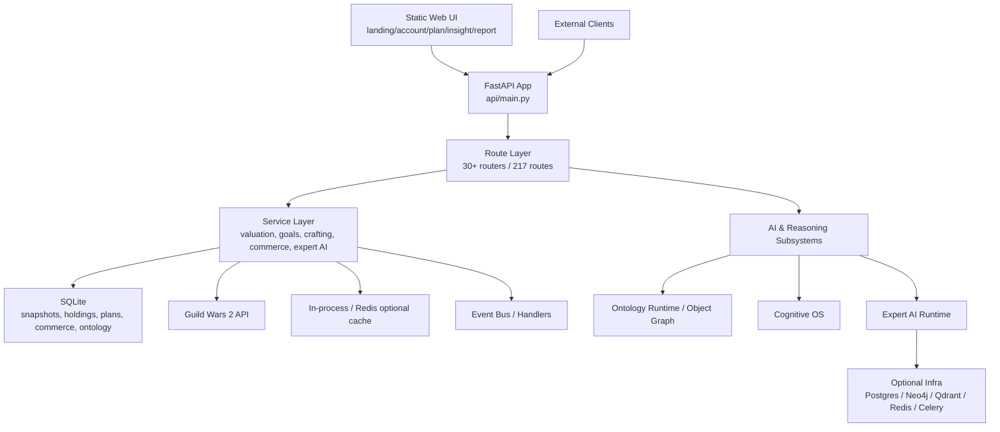
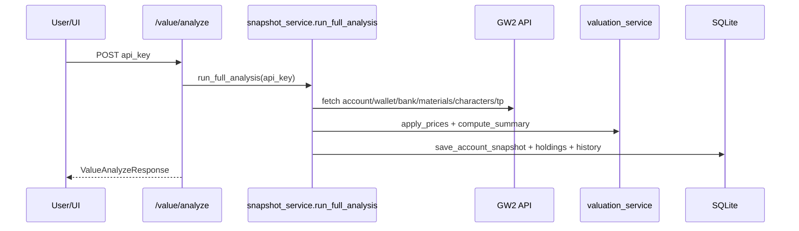
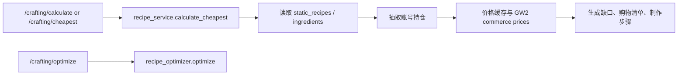
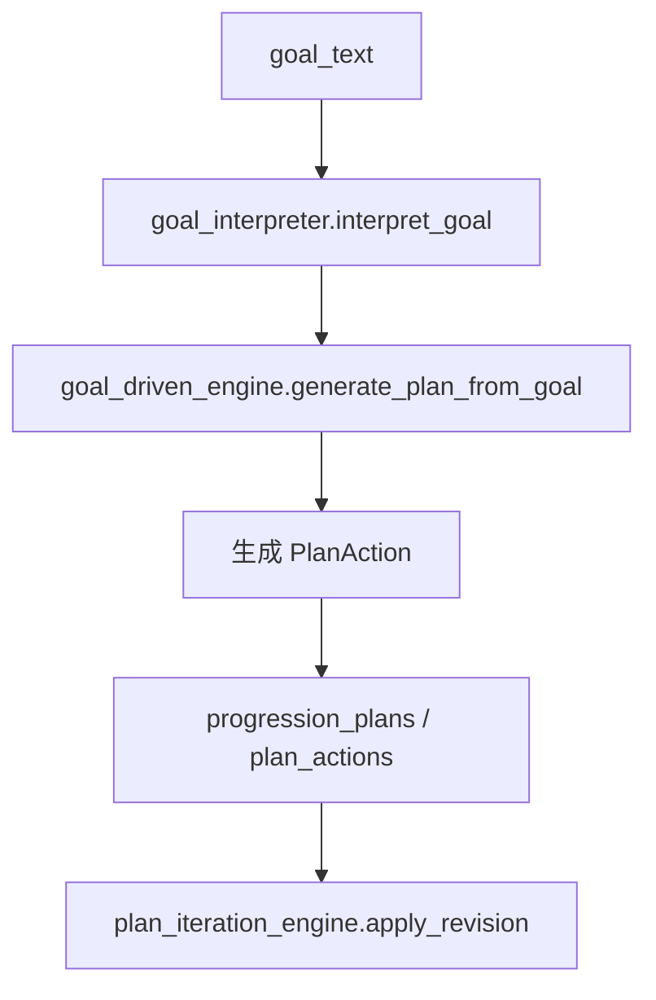

# GW2 Progression 代码图谱与系统成熟度分析

生成日期：2026-07-01  
分析范围：`D:\Projects\gw2-progression`  
主要依据：GitNexus 代码图谱、源码入口、路由注册、服务模块、数据模型、测试目录、Docker 配置。

## 1. 分析可信度与限制

- GitNexus 当前索引名称：`gw2-progression`。
- 图谱规模：431 个文件，14701 个符号，26880 条关系，300 条执行流程，520 个功能社区。
- GitNexus 报告索引落后 HEAD 7 个提交。已按项目要求执行 `npx gitnexus analyze`，但失败于 `.gitnexus\lbug` 写入权限：`Access is denied`。
- 因索引无法刷新，本报告采用“当前 GitNexus 图谱 + 源码核验”的方式生成；近 7 个提交内的细节可能未完全反映在图谱流程中。
- 全量 `pytest -q` 在 124 秒超时，未得到完整通过/失败结果；成熟度判断参考测试存在性、模块组织、接口完整度和源码实现形态，而不是本次完整回归结果。

## 2. 总体架构结论

该项目当前是一个以 FastAPI 为核心的 GW2 账号资产与成长规划单体系统，已具备较完整的后端 API、静态前端页面、SQLite 持久化、GW2 API 数据采集、账号估值、制作规划、目标驱动计划、商业化与 Expert AI 实验基础设施。

系统不是单一“小工具”，而是多条产品线并行演进：

- 玩家侧核心产品：账号分析、资产估值、物品搜索、制作成本、目标计划、Build 可达性、成长建议。
- 运营/商业化层：产品、订单、许可证、支付、交付、订阅、联盟分销、审计。
- 智能推理层：Goal-Driven OS、Ontology Runtime、Cognitive OS、Expert AI、Rule Engine v1/v2、Benchmark Arena。
- 数据基础设施：Data Mesh、数据采集扩展、静态数据、价格缓存、快照与历史差分。

当前架构偏“宽功能单体 + 多个实验性智能子系统”。核心玩家功能成熟度较高，AI/数据中台能力接口丰富但生产闭环成熟度不均衡。

## 3. 系统组成

### 3.1 应用入口

- 主应用入口：`src/gw2_progression/api/main.py`
- 框架：FastAPI
- 静态页面目录：`src/gw2_progression/static`
- 生命周期启动流程：
  - 初始化 SQLite 数据库。
  - 预热价格缓存。
  - 种子化 progression templates、products、providers。
  - 尝试处理 pending delivery jobs。
  - 自动导入 ontology handler。
  - 启动事件总线 worker。
  - 关闭时停止事件总线、关闭 GW2 client、价格 client、DB pool。

### 3.2 持久化层

默认主数据库为 SQLite：

- 路径：`data/gw2_progression.db`
- 连接池：`DB_POOL_SIZE = 20`
- 关键表：
  - 账号与估值：`account_snapshots`、`item_holdings`、`account_value_history`、`price_snapshots`、`valuation_warnings`
  - 会话与凭证：`account_sessions`、`credentials`、`credential_usage`
  - 目标与计划：`progression_goal_templates`、`goal_requirements`、`tracked_goals`、`user_goals`、`progression_plans`、`plan_actions`、`plan_revisions`
  - 静态数据：`static_items`、`static_recipes`、`recipe_ingredients`
  - 商业化：`products`、`orders`、`licenses`、`delivery_jobs`、`subscriptions`、`affiliates`、`referral_sales`
  - 协作与审计：`guild_workspaces`、`guild_members`、`workspaces`、`workspace_members`、`audit_log`
  - Ontology：`ontology_objects`、`ontology_relations`、`ontology_actions`、`snapshot_registry`

另有 Expert AI Docker 编排使用 PostgreSQL、Neo4j、Qdrant、Redis、Celery worker 与 trainer，但这属于增强基础设施，不是主应用启动的必要依赖。

### 3.3 主要功能社区

GitNexus 识别出的高权重模块：

| 模块 | 符号数 | 内聚度 | 判断 |
|---|---:|---:|---|
| Tests | 578 | 92% | 测试覆盖面广，是成熟度的重要支撑 |
| Services | 328 | 73% | 业务服务层，承担核心复杂度 |
| Cognitive_os | 152 | 68% | 智能操作系统实验层，功能面广 |
| Expert_ai | 139 | 91% | Expert AI 子系统，模块内聚较好 |
| Static | 87 | 73% | 静态前端与资源 |
| Benchmark | 82 | 91% | Arena、Elo、自博弈、演化测试 |
| Ontology | 71 | 84% | 对象图谱、动作约束、证据绑定 |
| Probabilistic | 54 | 92% | 概率推理、因果、GNN、策略 |
| Routes | 51 | 76% | API route 层 |
| Data_acquisition | 46 | 88% | 采集、扩展、注册、数据飞轮 |

## 4. 架构视图

## 5. 接口组成

GitNexus route map 识别到 217 条路由。源码中主要 router 前缀如下：

| 前缀 | 模块 | 功能 |
|---|---|---|
| `/auth/*` | `api/main.py` | API key 会话创建、校验、删除 |
| `/health`、`/metrics`、`/ws` | `api/main.py` | 健康检查、指标、WebSocket |
| `/api/account` | `routes/account.py` | 账号概览、账号资产视图 |
| `/value` | `routes/valuation.py` | 估值分析、物品搜索、持仓详情、价格深度、快照差分 |
| `/crafting` | `routes/crafting.py` | 制作计算、最便宜路径、优化结果、购物清单、制作步骤 |
| `/goals` | `routes/goals.py` | 目标模板、目标追踪 |
| `/goal-driven` | `routes/goal_driven.py` | 自然语言目标解析、计划生成、计划修订、渐进式分析 |
| `/builds` | `routes/builds.py` | Build 模板、推荐、可达性 |
| `/progression`、`/quests`、`/tp` | 多 route | 成长建议、日常任务、交易所策略 |
| `/reports`、`/commercial` | 多 route | 报告生成、商业报告 HTML |
| `/commerce`、`/payment` | 多 route | 产品、订单、许可证、支付 |
| `/subscriptions`、`/affiliates` | 多 route | 订阅投递、联盟分销 |
| `/credentials` | `routes/credentials.py` | 外部凭证管理 |
| `/guild`、`/workspaces` | 多 route | 公会与工作区协作 |
| `/mesh` | `routes/data_mesh.py` | Data Mesh 状态、来源、ingest、pipeline、normalize、confidence |
| `/ontology/runtime` | `routes/ontology_runtime.py` | Ontology 状态、动作执行、模拟、回放、依赖追踪 |
| `/rules`、`/rules/v2` | rule engine | 规则校验、抽取、演化、竞争、蒸馏、优化 |
| `/lifecycle` | lifecycle API | 生命周期重构、物品反推、制作/经济一致性检查 |
| `/cognitive-os` | cognitive OS | 初始化、step、训练、模拟、多世界、校准、策略、工厂 |
| Expert AI 无统一前缀 | `routes/expert_ai.py` | 图谱编译、运行态、推理、模拟、数据、记忆、训练、可观测性 |

## 6. 已实现功能与流程

### 6.1 账号分析与估值

核心流程：

已实现能力：

- GW2 API 数据采集与聚合。
- 钱包、材料、银行、角色背包、共享背包、交易所资产估值。
- 价格质量、流动性、价差、置信度、风险原因等元数据。
- 快照保存、历史趋势、快照差分、top gainers/decliners。
- 物品搜索、位置追踪、详情聚合、listing depth。

成熟度：高。  
证据：核心数据模型完整，数据库表与迁移齐全，GitNexus 流程覆盖 `post_value_analyze -> run_full_analysis`，测试文件包括 `test_valuation.py`、`test_database_core.py`、`test_delta.py`、`test_item_search.py`、`test_price_quality.py`。

### 6.2 制作计算与配方优化

核心流程：

已实现能力：

- 按目标物品与数量计算制作成本。
- 可选择使用已有材料。
- 递归配方树与 cycle guard。
- 直接买入 vs 制作成本对比。
- 购物清单、制作步骤、所需 discipline 输出。

成熟度：高到中高。  
证据：`recipe_service.py`、`recipe_optimizer.py`、`crafting_plan_service.py` 已成体系；测试覆盖 `test_crafting.py`、`test_crafting_plan.py`、`test_phase3.py`。主要风险是配方数据完整性和实时价格可用性。

### 6.3 目标追踪与 Goal-Driven OS

核心流程：

已实现能力：

- 自然语言目标解析，识别 MAKE_GOLD、FINISH_LEGENDARY、PREPARE_BUILD、CRAFT_ITEM、WEEKLY_PLAN 等类型。
- 从目标生成完整计划，包含优先级、成本、预计天数、7 日计划、行动置信度。
- 支持计划修订并记录 revision。
- 支持 progressive 分阶段返回账号初步结果、估值、Build/Goal、完整计划。

成熟度：中高。  
证据：核心引擎体量较大，接口完整，测试覆盖 `test_goal_interpreter.py`、`test_goal_driven.py`、`test_api_integration.py`、`test_ui_comprehensive.py`。风险是自然语言解析偏规则/启发式，计划质量依赖数据完整度和价格实时性。

### 6.4 Build 推荐与成长建议

已实现能力：

- Curated build 模板种子化。
- 账号职业、装备、特性、技能匹配。
- Readiness score、缺失物品、缺口成本。
- 成长建议、weekly plan、coach plan、craft-vs-buy advice。

成熟度：中高。  
证据：`build_service.py`、`progression_service.py`、`agent_service.py`、`decision_engine.py`、`player_advice.py` 等模块完整；有 `test_player_advice.py`、`test_engine.py`、`test_progression.py`。

### 6.5 Data Mesh 与数据采集

已实现能力：

- `/mesh/status`、`/mesh/ingest`、`/mesh/pipeline`、`/mesh/normalize`、`/mesh/confidence`、`/mesh/sources`。
- SourceRegistry 与 builtin sources。
- SchemaNormalizer 与 ConfidenceSystem。
- DataMeshBridge 串接多来源 ingest、pipeline、normalize。
- 数据扩展模块包含 horizontal、vertical、temporal、synthetic。

成熟度：中。  
证据：模块结构完整，测试覆盖 `test_data_mesh_v1.py`、`test_data_mesh_integration.py`、`test_data_expansion_contract.py`。GitNexus 查询未返回关键执行流程，说明这些能力更像独立组件/接口，不一定已深度接入核心玩家闭环。

### 6.6 Ontology Runtime 与对象图谱

已实现能力：

- Ontology 对象、关系、动作模型。
- action registry、object store、policy engine、QA gate、evidence binder、report mapper。
- runtime API 支持状态、reset、action、execute graph、simulate、LLM action、reasoning action、ingest、trace、dependencies、lineage、replay。
- Tool mesh 支持 governed action。

成熟度：中。  
证据：`ontology` 模块内聚度 84%，测试文件 `test_ontology.py` 很大，`test_ontology_runtime_api.py` 与 smoke test 存在。风险在于该层与主业务的边界仍较实验化，生产数据治理和错误恢复需要继续验证。

### 6.7 Cognitive OS、Rule Engine、Lifecycle

已实现能力：

- Cognitive OS：多 agent、人口模拟、成熟度评估、行为模型、概率推理、RL、时间状态、经济生命周期。
- Rule Engine v1：API schema 规则、LLM 规则、行为规则、经济规则、验证。
- Rule Engine v2：规则抽取、演化、竞争、GNN、LLM distill、RL reward/policy/optimizer、世界经济模拟。
- Lifecycle：正向 state evolution、反向依赖推理、轨迹生成、制作与经济规则校验。

成熟度：中。  
证据：接口、核心模块和大量测试存在，图谱识别到多个跨社区流程。风险是这些模块功能雄心很大，和核心产品链路相比更偏研究/原型平台，生产可观测性、数据闭环和用户级稳定性需要持续压实。

### 6.8 Expert AI 基础设施

已实现能力：

- 图谱编译、runtime state/entity/search/neighbors/trace/action/simulate/history/rollback。
- reasoning analyze/trace。
- economy simulation、world snapshot、agent spawn、labels/dataset/reasoning export。
- memory append/search/query/feedback/vector search。
- persistence health/readiness/snapshot/migrate/graph export/write。
- training dataset、train run/model/schedule/jobs。
- Celery worker、Redis queue、Postgres、Neo4j、Qdrant、trainer Docker Compose。

成熟度：中到中低。  
证据：模块内聚度 91%，基础设施齐全，有 `test_expert_ai_infrastructure.py` 和 Compose E2E 测试。但 GitNexus 查询 Expert AI 未返回主执行流程，说明它更多是独立平台能力；外部依赖多，生产部署和数据一致性风险较核心 SQLite 单体更高。

### 6.9 商业化与运营

已实现能力：

- 产品种子化、订单、许可证校验/使用、delivery jobs。
- Stripe 支付接口。
- 商业报告生成和 HTML 输出。
- 订阅、联盟分销、审计日志、工作区/公会协作。

成熟度：中。  
证据：数据库表、服务和 API 完整，测试覆盖 `test_commerce.py`、`test_delivery.py`、`test_production.py`、`test_production_engine.py`。风险是支付、交付和授权属于高一致性场景，仍需真实环境集成测试和幂等性审计。

## 7. 当前成熟度矩阵

| 功能域 | 成熟度 | 理由 |
|---|---|---|
| 账号抓取与估值 | 高 | 主链路清晰，模型/DB/API/测试齐全 |
| 物品搜索与价格质量 | 高 | 数据结构细，接口完善，有专项测试 |
| 制作计算与优化 | 高-中高 | 功能闭环完整，递归与 cycle guard 已覆盖 |
| 目标追踪与计划生成 | 中高 | API 与持久化完整，但计划质量依赖启发式和数据完整度 |
| Build 推荐 | 中高 | 已有模板和评分逻辑，真实 meta 数据更新机制仍需加强 |
| 静态前端 | 中高 | 多页面应用已实现，但不是现代前端工程化架构 |
| Data Mesh | 中 | 抽象完整，和核心业务耦合度仍有限 |
| Ontology Runtime | 中 | 模型和测试多，生产治理闭环仍需验证 |
| Cognitive OS / Rule Engine v2 | 中 | 能力覆盖广，更偏研究原型平台 |
| Expert AI | 中-中低 | 基础设施丰富，但外部依赖和生产链路复杂 |
| 商业化 | 中 | 数据表/API/service 完整，高风险支付交付需更强 E2E |
| 部署运维 | 中 | Docker/Compose/healthcheck 存在，缺少本次验证的完整运行证据 |
| 测试体系 | 中高 | 测试数量多，但本地全量测试超时，建议分层 CI |

## 8. 关键风险

1. 图谱索引当前落后 HEAD 7 个提交，且刷新失败，后续重构前需要修复 `.gitnexus\lbug` 权限问题。
2. 主应用是宽功能单体，router 和 service 数量较多，长期维护需要更清晰的边界、owner 和稳定 API 契约。
3. SQLite 连接池能支撑本地/轻量部署，但高并发、商业化和训练基础设施并存时，需要明确哪些数据迁移到 Postgres。
4. Expert AI、Cognitive OS、Rule Engine v2、Ontology 多套智能抽象并行，存在概念重叠，需要明确产品主链路与研究能力边界。
5. 支付、许可证、交付、订阅属于强一致性/高风险域，需要幂等处理、审计追踪、失败重试、真实 webhook 测试。
6. 全量测试在本地 124 秒超时，建议拆分 smoke/unit/integration/e2e/expert-ai profile，确保开发者能快速获得可信反馈。

## 9. 建议的下一步

1. 修复 GitNexus 索引权限，重新执行 `npx gitnexus analyze`，再生成一次差异版架构报告。
2. 把 API 分为 Core Product、Commerce、AI Lab、Infrastructure 四类，建立稳定性等级和发布门禁。
3. 为核心玩家流程建立最小 smoke suite：`auth -> value/analyze -> item search -> crafting -> goal-driven/generate -> report`。
4. 为商业化流程建立幂等性测试：订单创建、支付 webhook、许可证生成、交付任务重试。
5. 收敛智能层职责：Goal-Driven OS 作为产品计划层，Ontology 作为治理/证据层，Expert AI 作为实验训练层，避免多套系统都直接承担用户决策。
6. 将成熟功能和实验功能在路由、文档、部署开关上隔离，减少生产暴露面。

## 10. 总结

GW2 Progression 已经实现了一个相当完整的 GW2 账号成长助手：账号估值、资产搜索、制作优化、目标计划、Build 推荐、报告与商业化基础都具备可用闭环。代码库同时容纳了大量面向未来的 AI/图谱/规则/训练基础设施，这使系统上限很高，但也带来架构边界和成熟度不均的问题。

短期最值得强化的是：修复图谱索引、分层测试、明确核心产品 API、把商业化链路做强一致性验证。中期则应整理 AI 子系统边界，让智能层真正服务于玩家核心流程，而不是形成多个平行实验平台。
