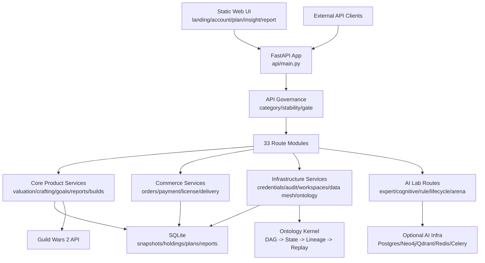
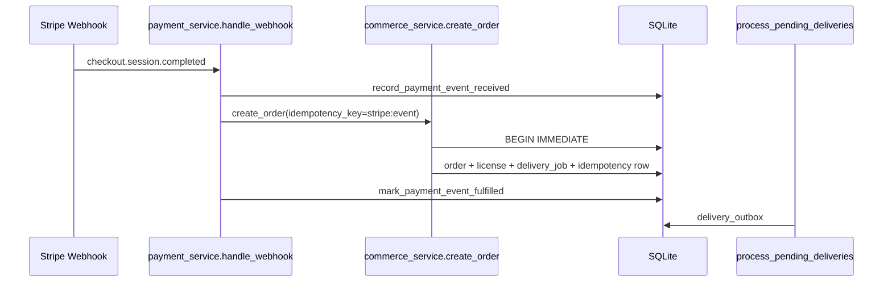

# GW2 Progression 代码图谱与实现成熟度分析

生成日期：2026-07-01  
分析范围：`D:\Projects\gw2-progression`  
主要依据：GitNexus 最新索引、FastAPI 路由注册、服务模块、数据库 schema、测试套件、现有实现文档。

## 1. 图谱快照

已执行：

```powershell
npx gitnexus analyze
```

GitNexus 当前索引结果：

| 指标 | 数值 |
| --- | ---: |
| Nodes | 15,826 |
| Edges | 28,934 |
| Clusters | 548 |
| Execution flows | 300 |

源码规模快照：

| 区域 | 文件数 |
| --- | ---: |
| `src/gw2_progression/api/routes` | 33 |
| `src/gw2_progression/services` | 47 |
| `src/gw2_progression/ontology` | 28 |
| `src/gw2_progression/expert_ai` | 15 |
| `src/gw2_progression/cognitive_os` | 37 |
| `src/gw2_progression/rule_engine_v2` | 27 |
| `src/gw2_progression/lifecycle` | 25 |
| `src/gw2_progression/data_mesh` | 9 |
| `src/gw2_progression/data_acquisition` | 26 |
| `src/gw2_progression/static` | 27 |
| `tests` | 62 |
| `docs/*.md` | 27 |

## 2. 总体结论

当前系统已经从“多功能原型单体”推进到“有治理边界的 Beta 单体平台”：

- Core Product 主链路已具备可运行闭环：auth -> value/analyze -> item search -> crafting -> goal-driven/generate -> report。
- Commerce 已具备数据库级幂等、支付事件 receipt、license 原子使用、delivery outbox。
- Ontology Runtime 已从设计层推进为真实执行内核：DAG scheduler、ontology validation、state transition、lineage、tenant persistence、durable replay。
- API Governance 已按 Core Product、Commerce、AI Lab、Infrastructure 四类隔离，并在生产默认关闭 AI Lab/Experimental。
- AI Lab、Cognitive OS、Rule Engine v2、Expert AI、Lifecycle、Data Mesh 仍是能力很宽的实验/平台层，整体成熟度低于核心产品链路。

总体评级：L3 Beta。  
主要阻碍 L4 的因素是版本化 migration、外部支付沙箱矩阵、生产级 outbox worker/死信、OpenAPI 发布门禁、Ontology manifest 持久化/签名、长 lineage checkpoint、AI Lab adapter 收敛。

## 3. 实现架构



## 4. API 层与发布治理

入口：`src/gw2_progression/api/main.py`

已实现：

- `lifespan()` 初始化 DB、价格缓存、progression templates、products、providers、delivery jobs、event bus。
- 中间件覆盖 security headers、request logging、metrics、rate limit、session token 注入。
- `ROUTER_BINDINGS` 统一注册 33 个路由模块。
- `include_governed_routers()` 根据 `API_ROUTE_GOVERNANCE` 和环境变量决定路由是否暴露。
- `/api/governance/routes` 输出运行时治理快照。

治理分类：

| 分类 | 生产姿态 | 典型路由 |
| --- | --- | --- |
| Core Product | 默认开启 | account、valuation、crafting、goals、goal_driven、reports、builds |
| Commerce | 默认开启，要求幂等测试 | commerce、commercial、payment、subscriptions、affiliates |
| Infrastructure | 默认开启，需平台审查 | credentials、audit、workspaces、data_mesh、ontology_runtime |
| AI Lab | 生产默认关闭 | expert_ai、cognitive_os、rule_v2、lifecycle、arena、v4、v5、production |

成熟度：L3 Beta。  
证据：`tests/test_api_governance.py` 覆盖分类完整性、生产默认关闭 AI Lab、governance snapshot、核心路由禁止导入 AI Lab 决策依赖。  
缺口：governance 仍是 Python 字典，未写入 OpenAPI extension 或部署产物；Internal/Beta 路由缺少统一鉴权 guard。

## 5. Core Product 实现层

### 5.1 玩家主流程

最小 smoke：

```text
auth/session -> value/analyze -> value/items/search -> crafting/calculate/cheapest -> goal-driven/generate -> reports/generate
```

实现证据：

- `tests/test_core_player_smoke.py` 覆盖完整玩家链路。
- `auth/session` 调用 `fetch_all()` 校验 API key，并通过 `auth_service.create_session()` 持久化会话。
- `valuation` 路由调用 `run_full_analysis()`，生成 `ValueAnalyzeResponse`。
- `crafting` 路由调用 `calculate_cheapest()`。
- `goal_driven` 路由调用 `interpret_goal()` 和 `generate_plan_from_goal()`。
- `reports` 路由调用 `generate_report()`。

成熟度：L3 Beta。  
优势：核心产品路径清晰，有 smoke suite。  
缺口：smoke 大量使用 mock；还缺少真实 GW2 API fallback、真实 DB 端到端 fixture、浏览器级主路径门禁。

### 5.2 估值、搜索、制作、计划

| 功能 | 实现层 | 成熟度 | 证据 | 主要缺口 |
| --- | --- | --- | --- | --- |
| 账号估值 | `analyzer.py`、`valuation_service.py`、`snapshot_service.py`、`price_service.py` | L3 | `test_valuation.py`、`test_database_core.py`、`test_delta.py`、核心 smoke | 价格源异常、GW2 API 失败和长期历史容量策略仍需加强 |
| 物品搜索 | `item_search_service.py`、`item_service.py`、`static_data_service.py` | L3 | `test_item_search.py`、`test_item_service.py` | 静态数据版本更新和搜索排序质量仍需运营验证 |
| 制作计算 | `recipe_service.py`、`recipe_optimizer.py`、`crafting_plan_service.py` | L3 | `test_crafting.py`、`test_crafting_plan.py` | 配方完整性、实时价格回退、复杂递归成本性能 |
| Goal-Driven OS | `goal_interpreter.py`、`goal_driven_engine.py`、`plan_iteration_engine.py` | L3 | `test_goal_interpreter.py`、`test_goal_driven.py` | 计划质量偏规则/启发式，缺少真实用户反馈闭环 |
| Build/Advice | `build_service.py`、`agent_service.py`、`decision_engine.py`、`advice/player_advice.py` | L2-L3 | `test_engine.py`、`test_player_advice.py`、`test_progression.py` | build meta 数据更新、推荐解释和回归验证不足 |

## 6. Commerce 实现层

核心图谱流程：



已实现：

- `create_order()` 使用 `BEGIN IMMEDIATE` 串行化同 idempotency key 创建。
- `order_idempotency_keys` 支持重复请求回放已有 order/license。
- `payment_events` 记录 provider event receipt，重复 Stripe event 只 fulfillment 一次。
- `licenses.order_id` 唯一索引，license 使用通过单条条件 `UPDATE` 保证原子递增。
- `delivery_jobs.order_id` 唯一，邮件副作用写入 `delivery_outbox`，支持失败后重试。

成熟度：L3 Beta。

| 子域 | 成熟度 | 证据 | 主要缺口 |
| --- | --- | --- | --- |
| 订单幂等 | L3 | `test_commerce_idempotency_db.py` | 外部支付并发压测、跨 DB 迁移策略 |
| 支付 webhook | L3 | `test_payment_webhook_db.py` | Stripe 沙箱乱序/重复/失败矩阵 |
| License | L3 | `test_license_atomic_usage.py` | license 生命周期策略、运营补偿界面 |
| Delivery outbox | L3 | `test_delivery_outbox.py` | 独立 worker、死信队列、dashboard |
| 订阅/联盟 | L2-L3 | `subscriptions`、`affiliates` 路由和服务存在 | 真实结算、退款、反作弊和审计不足 |

## 7. Ontology Runtime 实现层

当前公开 API 已收敛：

- `POST /ontology/runtime/kernel/action`
- `POST /ontology/runtime/scheduler/execute`
- `POST /ontology/runtime/persistence/replay`

核心执行模型：


已实现：

- `OntologyRuntimeKernel.execute()` 是唯一状态变更入口。
- `ExecutionGraphCompiler` 生成 manifest 和 DAG。
- `RuntimeScheduler` 以 deterministic ready queue 执行依赖就绪节点。
- `OntologyValidator` 在状态变更前校验 action。
- `LineageTracker` 记录 before/action/after hash、validation evidence、scheduler evidence。
- `KernelPersistence` 使用 SQLite 按 tenant 保存 state/lineage。
- `replay_persisted()` 从 durable lineage 重建最终 state 并比较 persisted/replayed hash。
- 旧公开 API `/action`、`/execute`、`/compiled/execute`、`/decision/decide`、`/rl/optimize` 已移除。

成熟度：L3 Beta。

证据：

- `tests/test_ontology.py::TestOntologyRuntimeKernel`
- `tests/test_ontology_runtime_api.py`
- `tests/test_ontology_runtime_persistence.py`
- `tests/test_ontology_runtime_tenant_replay.py`
- `tests/test_ontology_runtime_smoke.py`

主要缺口：

- compiled graph manifest 尚未持久化/签名。
- replay 还没有跨版本 schema compatibility 检查。
- 长 lineage 未实现 checkpoint/pruning。
- `guarantees()` 仍有能力声明成分，未拆成每条 action 的证据集合。

## 8. Infrastructure 与数据层

### 8.1 SQLite 与迁移

已实现：

- `database.py` 内置 `CREATE_TABLES`。
- `init_db()` 启动时建表、补列、建索引。
- `using_db()` 管理连接获取、commit/rollback、连接健康检查。
- `_TEST_DB_URL` 支持测试隔离。

成熟度：L2-L3。  
优势：本地/轻量部署简单，测试可控。  
缺口：schema 仍是内嵌 SQL 和 try/except migration，缺少版本化 migration、回滚、迁移审计。

### 8.2 Observability 与运维

已实现：

- `/health` 检查 DB。
- `/metrics` 输出内存 metrics。
- request id、日志、基础错误统计、security headers、rate limit。
- event bus worker 在应用生命周期中启动/停止。

成熟度：L2。  
缺口：缺少结构化审计查询、SLO/error budget、外部监控接入、delivery/payment dashboard。

### 8.3 Data Mesh / Data Acquisition

已实现：

- Data Mesh routes：status、sources、ingest、pipeline、normalize、confidence、integration。
- Source registry、schema normalizer、confidence system。
- Data acquisition 包含 ingestion adapters、fetcher、normalizer、orchestrator、source registry、data loop、dataset builder、stream engine。

成熟度：L2-L3。  
证据：`test_data_mesh_v1.py`、`test_data_mesh_integration.py`、`test_data_expansion_contract.py`。  
缺口：与 Core Product 主链路耦合较弱，生产数据质量/回放/失败恢复尚未形成强门禁。

## 9. AI Lab 与实验层

| 子系统 | 角色定位 | 当前成熟度 | 证据 | 主要风险 |
| --- | --- | --- | --- | --- |
| Expert AI | 实验训练和模拟层 | L2-L3 | `expert_ai` 模块、Docker Compose、`test_expert_ai_infrastructure.py` | 外部依赖多，生产部署和数据一致性风险高 |
| Cognitive OS | 多 agent/概率/策略实验 | L2 | `cognitive_os` 37 个文件、`test_cognitive_os.py` | 概念面宽，产品闭环和稳定接口不足 |
| Rule Engine v2 | 规则演化/竞争/GNN/RL | L2 | `rule_engine_v2` 27 个文件、`test_rule_engine_v2.py` | 更偏研究平台，缺少生产 promotion contract |
| Lifecycle | 正反向推理、轨迹、模拟 | L2 | `lifecycle` 25 个文件、`test_lifecycle.py` | 与 Ontology Runtime 职责有重叠，需要 adapter 收敛 |
| Benchmark/Arena | agent 评测、自博弈、Elo | L2 | `benchmark` 模块、`test_benchmark.py` | 不应默认参与生产决策 |

治理状态：

- AI Lab 路由标记为 Experimental。
- 生产环境默认 `ENABLE_AI_LAB_ROUTES=false` 且 `ENABLE_EXPERIMENTAL_ROUTES=false`。
- Core Product 路由测试禁止导入 AI Lab 决策依赖。

成熟度结论：AI Lab 能力丰富，但整体仍应视为 L2 实验层；只有通过 adapter、合同测试、数据隔离和 release gate 后才能 promotion。

## 10. 前端与用户界面

已实现：

- 静态页面：landing、account、plan、insight、report。
- JS/CSS 分页面维护，包含 v2 版本脚本。
- `app.mount("/static", StaticFiles(...))` 提供静态资源。
- 页面入口由 FastAPI 返回 HTML。

成熟度：L2-L3。  
优势：可直接服务核心页面，适合快速产品验证。  
缺口：不是模块化前端工程，缺少系统化端到端浏览器门禁、组件契约和构建产物版本管理。

## 11. 测试成熟度

| 测试层 | 当前状态 | 成熟度 |
| --- | --- | --- |
| Core smoke | 覆盖玩家最小闭环 | L3 |
| API Governance | 覆盖分类、生产 gates、依赖隔离 | L3 |
| Commerce DB 幂等 | 覆盖订单、webhook、license、outbox | L3 |
| Ontology Runtime | 覆盖 DAG、API、tenant、persistence、smoke | L3 |
| Core services unit | 覆盖估值、制作、目标、item、price | L3 |
| AI Lab tests | 覆盖存在但生产语义弱 | L2 |
| Browser E2E | 有 e2e 文件，但未作为稳定门禁证明 | L1-L2 |
| Full regression | 本轮未跑全量，建议拆 profile | L2 |

当前推荐 Beta 门禁：

```powershell
pytest -q tests/test_api_governance.py tests/test_core_player_smoke.py tests/test_commerce.py tests/test_delivery.py tests/test_ontology_runtime_smoke.py tests/test_ontology_runtime_api.py tests/test_ontology_runtime_persistence.py tests/test_ontology_runtime_tenant_replay.py tests/test_ontology.py::TestOntologyRuntimeKernel
ruff check src/gw2_progression/api/governance.py src/gw2_progression/api/routes/ontology_runtime.py src/gw2_progression/ontology/runtime_kernel.py
npx gitnexus detect-changes --scope unstaged --repo gw2-progression
```

## 12. 总成熟度矩阵

| 层级 | 当前等级 | 说明 |
| --- | --- | --- |
| Core Product | L3 Beta | 主流程闭环，测试较强；真实外部数据 E2E 仍不足 |
| Commerce | L3 Beta | 幂等核心已补强；仍需真实支付沙箱和运营补偿 |
| API Governance | L3 Beta | 分类/gate 已实现；OpenAPI/CI 发布产物仍不足 |
| Ontology Runtime | L3 Beta | 单内核、持久化、回放已实现；manifest/checkpoint 未完成 |
| Infrastructure/DB | L2-L3 | SQLite 和连接池可用；迁移体系不够生产化 |
| Observability/Ops | L2 | 有基础 metrics/logging；缺少 SLO 和运营 dashboard |
| Data Mesh | L2-L3 | 抽象完整；生产数据质量门禁不足 |
| AI Lab | L2 | 能力丰富但实验属性强，需继续隔离 |
| Frontend | L2-L3 | 静态产品页面可用；工程化和浏览器门禁不足 |

## 13. 下一阶段优先级

1. 为数据库引入版本化 migration，替代 `CREATE_TABLES + ALTER try/except`。
2. 为 Commerce 增加 Stripe 沙箱矩阵、delivery outbox 独立 worker、死信队列和运营补偿 API。
3. 为 Ontology Runtime 持久化 compiled manifest，增加签名/hash、schema compatibility、长 lineage checkpoint。
4. 将 API Governance 输出到 OpenAPI extension 或部署快照，作为 CI release artifact。
5. 给 AI Lab 建 promotion contract：adapter、数据隔离、合同测试、生产 gate。
6. 增加真实 GW2 API fallback 的分层集成测试和浏览器 E2E smoke。

## 14. 当前判断

系统实现已经达到“受控 Beta”水平：核心玩家价值链、商业化幂等、API 治理、Ontology 执行内核都有可验证代码和测试支撑。它还不是 L4 Production Ready，因为外部支付、迁移、运维、长期 replay 和 AI Lab promotion 这些生产级约束尚未完全闭环。
