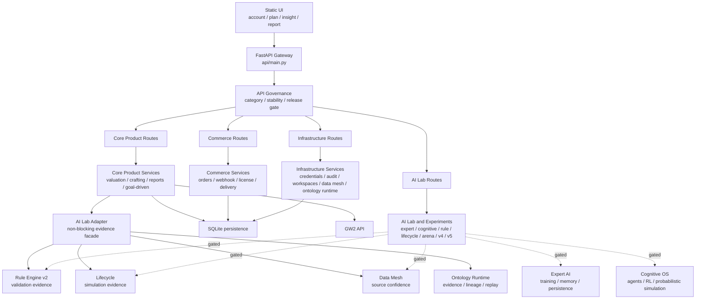
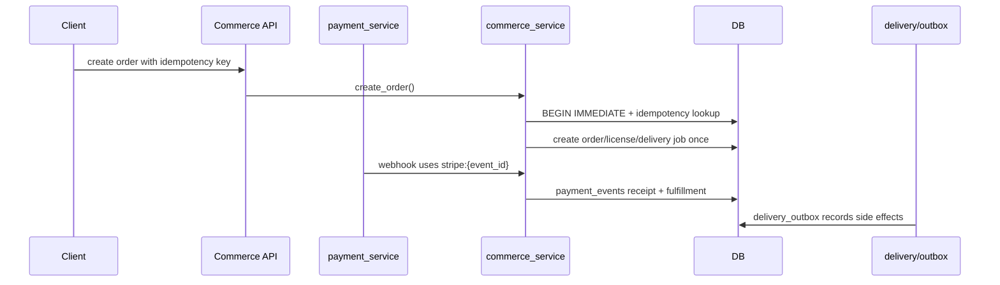

# GW2 Progression Code Graph, Architecture, Maturity, and Redundancy Analysis

Updated: 2026-07-01

Scope: current repository implementation at `7cd8889`.

Primary evidence:

- `npx gitnexus analyze`
- `npx gitnexus query "auth value analyze item search crafting goal driven generate report core player smoke" --repo gw2-progression`
- `npx gitnexus query "commerce order payment webhook license delivery idempotency subscription commercial" --repo gw2-progression`
- `npx gitnexus query "AI Lab Cognitive OS Rule Engine v2 Expert AI Lifecycle Data Mesh Ontology Runtime evidence confidence adapter" --repo gw2-progression`
- `npx gitnexus context generate_plan_from_goal --repo gw2-progression`
- `npx gitnexus context create_order --repo gw2-progression`
- `npx gitnexus context OntologyRuntimeKernel --repo gw2-progression`
- `npx gitnexus context DataMeshBridge --repo gw2-progression`
- FastAPI route scan, package scan, tests, and existing architecture docs.

## 1. Code Graph Snapshot

GitNexus index was refreshed before this analysis.

| Metric | Current |
| --- | ---: |
| Nodes | 15,953 |
| Edges | 29,086 |
| Clusters | 551 |
| Execution flows | 300 |

Implementation surface:

| Area | Python files | Non-comment LOC | Classes | Functions/methods | Test files referencing area |
| --- | ---: | ---: | ---: | ---: | ---: |
| `api` | 36 | 3,425 | 25 | 273 | 33 |
| `services` | 48 | 8,010 | 10 | 273 | 37 |
| `ontology` | 28 | 4,314 | 52 | 254 | 6 |
| `data_mesh` | 9 | 1,365 | 17 | 56 | 3 |
| `data_acquisition` | 26 | 3,017 | 46 | 193 | 2 |
| `cognitive_os` | 37 | 4,625 | 76 | 330 | 2 |
| `rule_engine` | 19 | 816 | 15 | 64 | 4 |
| `rule_engine_v2` | 27 | 1,212 | 32 | 124 | 3 |
| `lifecycle` | 25 | 1,662 | 30 | 132 | 4 |
| `expert_ai` | 15 | 1,867 | 40 | 208 | 4 |
| `benchmark` | 9 | 1,096 | 20 | 95 | 2 |
| `trainer` | 4 | 353 | 2 | 24 | 2 |
| `bors` | 4 | 394 | 10 | 21 | 4 |

Key interpretation:

- Core Product and Commerce are smaller, more test-connected, and route-governed.
- AI Lab / Cognitive OS / Expert AI / Lifecycle / Rule Engine v2 are broad capability layers with many classes and endpoints but fewer production flow edges.
- Ontology Runtime is now a central infrastructure/evidence layer, but its class surface remains wide.

## 2. System Architecture



Current architectural stance:

- `api/main.py` owns app startup, middleware, route binding, auth/session endpoints, static pages, health, metrics, and governance snapshot.
- `api/governance.py` classifies routes into Core Product, Commerce, AI Lab, and Infrastructure with GA/Beta/Experimental/Internal stability and release gates.
- Core Product owns user-facing decisions. `goal_driven_engine.generate_plan_from_goal()` is the main plan generation entrypoint.
- AI Lab has been converted from parallel decision owner into an internal evidence enhancer via `services/ai_lab_adapter.py`.
- Ontology Runtime owns evidence, constraints, lineage, replay, and tenant-scoped runtime persistence.
- Data Mesh owns source quality, freshness, confidence, and source registry governance.

## 3. API Surface

FastAPI scan found 286 route handlers.

Largest route modules:

| Route module | Endpoint count | Category posture |
| --- | ---: | --- |
| `api/routes/expert_ai.py` | 62 | AI Lab, Experimental, gated |
| `cognitive_os/api.py` | 32 | AI Lab, Experimental, gated |
| `api/routes/ontology_runtime.py` | 19 | Infrastructure, Beta, gated |
| `api/routes/valuation.py` | 13 | Core Product, GA |
| `api/main.py` | 12 | Auth/static/health/metrics/governance |
| `api/routes/crafting.py` | 12 | Core Product, GA |
| `api/routes/data_mesh.py` | 9 | Infrastructure, Beta |
| `lifecycle/api/lifecycle_api.py` | 9 | AI Lab, Experimental, gated |
| `rule_engine_v2/api/rule_api.py` | 8 | AI Lab, Experimental, gated |
| `api/routes/commerce.py` | 7 | Commerce, Beta, gated |

Governed categories:

| Category | Production posture | Examples | Maturity |
| --- | --- | --- | --- |
| Core Product | Always on | `account`, `valuation`, `crafting`, `goal_driven`, `reports`, `builds`, `progression` | L3 Beta |
| Commerce | Enabled through commerce gate | `commerce`, `commercial`, `payment`, `subscriptions`, `affiliates` | L3 Beta |
| Infrastructure | Enabled through infra gate | `credentials`, `audit`, `workspaces`, `data_mesh`, `ontology_runtime` | L2-L3 |
| AI Lab | Disabled by default in production | `expert_ai`, `cognitive_os`, `rule_v2`, `lifecycle`, `arena`, `v4`, `v5`, `production` | L1-L3 by subarea |

Risk interpretation:

- The largest public surface belongs to experimental layers, not the mature product chain.
- The governance gate lowers production exposure, but route count remains a maintenance and documentation burden.
- AI Lab route modules should not be treated as product APIs until they have contracts, auth policy, and release gates equivalent to Core Product.

## 4. Core Product Functional Flow

Minimum player smoke flow:

```text
POST /auth/session
POST /value/analyze
GET  /value/items/search
POST /crafting/calculate/cheapest
POST /goal-driven/generate
POST /reports/generate
```

Graph evidence:

- `generate_plan_from_goal()` is called by `api/routes/goal_driven.py::post_generate` and `progressive_stream_service.py::stage_4_full_plan`.
- `generate_plan_from_goal()` calls goal-specific action generators, account-state extraction, price/build helpers, ontology sell-impact checks, and `enhance_plan_with_ai_lab()`.
- The AI Lab enhancement is non-blocking: adapter failure returns the original product plan.

Maturity:

| Capability | Current level | Evidence | Gaps |
| --- | --- | --- | --- |
| Session auth | L3 | `/auth/session`, session validation, smoke coverage | Need stronger production auth model and admin scopes |
| Account value analysis | L3 | value route, snapshot/value services, smoke coverage | Real GW2 API chaos/fallback tests still limited |
| Item search/detail | L3 | item/search services and tests | Search quality and static-data refresh are operational concerns |
| Crafting cost/plan | L3 | crafting services and tests | Complex recursive recipes and market fallback need capacity checks |
| Goal-driven plan | L3 | direct tests and smoke suite | Quality remains heuristic; needs user outcome feedback loop |
| Report generation | L3 | report route/service and smoke suite | Report schema/version compatibility not fully formalized |

Overall Core Product maturity: L3 Beta.

## 5. Commerce Flow

Primary commercial flow:



Graph evidence:

- `create_order()` is called by `payment_service.handle_webhook`, `commercial.post_checkout`, `commerce.post_order`, and `affiliates.post_affiliate_purchase`.
- `create_order()` calls `_fetch_order_by_idempotency`, `get_product`, `_generate_license_key`, and `_order_result`.
- GitNexus identifies webhook and affiliate purchase flows around `create_order()`.

Maturity:

| Capability | Current level | Evidence | Gaps |
| --- | --- | --- | --- |
| Order idempotency | L3 | idempotency key replay and SQLite concurrency test | Need external provider sandbox matrix |
| Payment webhook receipt | L3 | provider event receipt table and replay tests | Need unordered/duplicate/failed Stripe event matrix |
| License generation/use | L3 | unique license/order link, atomic use counter | Need migration-hardening and admin recovery |
| Delivery retry/outbox | L3 | outbox records, retry tests | Need standalone worker, dead letter queue, dashboard |
| Commercial reports | L2-L3 | report generation route and checkout route | Product entitlement/report schema needs tightening |

Overall Commerce maturity: L3 Beta, not yet L4 Production Ready.

## 6. Ontology Runtime and Evidence Layer

Implemented role:

- Infrastructure/evidence layer, not direct product decision owner.
- Provides kernel action execution, DAG scheduler execution, simulation, lineage, replay, persistence, tenant isolation, and guarantees report.
- AI Lab Adapter binds product plan assessment as evidence through Ontology Runtime.

Important surface:

- `POST /ontology/runtime/kernel/action`
- `POST /ontology/runtime/scheduler/execute`
- `POST /ontology/runtime/persistence/replay`
- State/lineage/query/trace endpoints for inspection.

Graph evidence:

- `OntologyRuntimeKernel` extends `OntologyKernel`.
- It owns methods including `execute`, `ingest_normalized`, `execute_graph`, `compile`, `execute_compiled`, `simulate`, `validate_llm_action`, `execute_llm_action`, `replay`, `persist`, `load_persisted`, `replay_persisted`, `guarantees`, `convergence_report`, and `execute_kernel_action`.

Maturity: L3 Beta.

Strengths:

- Unified mutation path through validated kernel actions.
- Tenant-scoped state/lineage persistence.
- Durable replay coverage.
- Redundant legacy public runtime routes have already been removed.

Gaps:

- `OntologyRuntimeKernel` remains a very wide class; runtime, compiler, replay, persistence, query, and policy compatibility methods live in one object.
- Compiled manifests are not yet durable, versioned, and signed as long-term audit artifacts.
- Long lineage replay needs checkpointing and performance tests.
- Some compatibility methods (`decide`, `optimize_policy`, compiled execution helpers) still exist in the class even when no longer exposed as public routes.

## 7. Data Mesh

Implemented role:

- Data quality/source governance layer.
- Routes expose status, health, ingestion, pipeline, normalization, confidence, source registry, and bridge status.
- AI Lab Adapter now uses `DataMeshConfidenceAdapter` to map action data sources into confidence scores and risk notes.

Graph evidence:

- `DataMeshBridge` is imported by the Data Mesh API route and exported by the package.
- It owns bridge methods across DGSK, OOSK, BORS, KB grounding, training, ingestion, pipeline, normalization, and status.

Maturity: L2-L3.

Strengths:

- Source registry and confidence system exist.
- Integrated into product plan evidence without letting Data Mesh decide for users.
- Test coverage exists for integration and v1 behavior.

Gaps:

- `DataMeshBridge` currently combines too many platform roles: graph compilation, runtime sync, decision evaluation, KB grounding, training, ingestion, normalization, and status.
- `data_acquisition` overlaps with Data Mesh ingestion/source registry concepts.
- Production source freshness policy and SLA are not yet formalized.

## 8. AI Lab, Cognitive OS, Rule Engine, Lifecycle, Expert AI

Current role boundary:

| Layer | Intended role | Current maturity | Production exposure |
| --- | --- | --- | --- |
| AI Lab Adapter | Internal evidence facade for product plans | L3 | No new public product route |
| Rule Engine v2 | Bounded validation/simulation evidence | L2-L3 | AI Lab gated |
| Lifecycle | Simulation and trajectory evidence | L2-L3 | AI Lab gated |
| Expert AI | Offline training, memory, persistence, candidate generation | L1-L2 overall, some parts L3 | AI Lab gated |
| Cognitive OS | Agents, RL, probabilistic simulation, data factory | L1-L2 overall, some modules L3 | AI Lab gated |
| Arena/Benchmark | Offline evaluation harness | L2 | AI Lab gated |

Highest-value current application:

- Keep Goal-Driven OS as the only user-facing planning owner.
- Use AI Lab Adapter to attach validation, simulation, evidence, and confidence.
- Use Expert AI only for offline candidate ranking and evaluation until it can pass replay/audit gates.
- Use Cognitive OS and Arena as simulation/evaluation labs, not production decision engines.

## 9. Redundancy Analysis

### 9.1 Decision ownership redundancy

Observed modules that can make or evaluate decisions:

- `services/goal_driven_engine.py`
- `services/decision_engine.py`
- `services/production_engine.py`
- `services/v4_optimizer.py`
- `services/v5_learning.py`
- `expert_ai/core.py`
- `cognitive_os/engine.py`
- `bors/business_decision.py`
- `data_mesh/integration.py::evaluate_decision`
- `ontology/runtime_kernel.py::decide`

Risk:

- Multiple systems can appear to own user decisions.
- Product behavior becomes hard to explain when several layers rank, optimize, or decide independently.

Recommended convergence:

- Product owner: `goal_driven_engine.py`.
- Product facade: `agent_service.py` or `/agent/*` may call Goal-Driven, but should not independently rank final decisions.
- Evidence providers: Rule v2, Lifecycle, Data Mesh, Ontology.
- Offline candidates only: Expert AI, Cognitive OS, Arena, v4/v5.
- Deprecate or gate `production_engine`, `/engine/*`, `/v4/*`, `/v5/*` from product docs unless explicitly labeled AI Lab.

### 9.2 Simulation redundancy

Observed simulation engines:

- `services/ai_lab_adapter.py::_simulate_plan`
- `lifecycle/core/engine.py`
- `expert_ai/simulation.py`
- `cognitive_os/engine.py`
- `benchmark/arena.py`
- `rule_engine_v2/simulation/*`
- `ontology/runtime_kernel.py::simulate`

Risk:

- Simulation semantics can drift: wallet, crafting, market, progression, and ontology action effects may differ by subsystem.

Recommended convergence:

- Product risk simulation: AI Lab Adapter uses bounded, shallow simulation only.
- Domain trajectory simulation: Lifecycle.
- Ontology action simulation/replay: Ontology Runtime.
- Agent/world simulation: Expert AI/Cognitive OS/Arena for offline evaluation only.
- Add a shared `SimulationContext` contract before promoting any simulation output into user-facing reports.

### 9.3 Training and learning redundancy

Observed learning/training surfaces:

- `expert_ai/training.py`, `expert_ai/scheduler.py`, `trainer/*`
- `cognitive_os/rl/*`
- `services/v5_learning.py`
- `benchmark/evolution.py`
- `rule_engine_v2/core/evolution/*`
- `data_acquisition/flywheel/*`

Risk:

- Many loops can collect or transform training data with different schemas.

Recommended convergence:

- Single event schema: plan/action/outcome event.
- Single offline promotion path: export -> train -> arena compare -> ontology replay audit -> adapter gate.
- Keep training routes disabled in production unless using isolated data stores and anonymized inputs.

### 9.4 Data ingestion/source registry redundancy

Observed source/data layers:

- `data_mesh/sources/registry.py`
- `data_acquisition/registry/source_registry.py`
- `data_mesh/ingestion.py`
- `data_acquisition/ingestion/*`
- `services/static_data_service.py`
- `services/snapshot_service.py`

Risk:

- Source freshness and trust can be computed differently by Product, Data Mesh, and Data Acquisition.

Recommended convergence:

- Data Mesh owns source identity, freshness, confidence, and source registry.
- Data Acquisition owns fetch/normalize/expansion pipelines.
- Product services consume snapshots and Data Mesh confidence, not raw source trust logic.

### 9.5 Runtime/evidence redundancy

Observed evidence/runtime surfaces:

- Ontology Runtime lineage/replay.
- AI Lab Adapter evidence bundle.
- Data Mesh confidence evidence.
- Rule/Lifecycle validation evidence.
- Expert AI memory/persistence.

Risk:

- Evidence may be persisted in multiple incompatible formats.

Recommended convergence:

- Ontology Runtime is the durable evidence/audit spine.
- Other systems emit evidence into the adapter contract and/or Ontology Runtime.
- Expert AI memory should remain experiment-local until mapped to ontology evidence entities.

## 10. Maturity by Layer

| Layer | Current level | Rationale | Next maturity gate |
| --- | --- | --- | --- |
| API Gateway/Governance | L3 | Categories, stability levels, environment gates, governance endpoint, tests | OpenAPI extensions, startup route snapshot, admin guards |
| Core Product | L3 | Smoke suite and clear product flow | Real API fallback matrix, browser E2E, feedback loop |
| Commerce | L3 | DB idempotency, webhook receipts, license atomic use, outbox tests | Stripe sandbox matrix, worker/DLQ, migration hardening |
| Ontology Runtime | L3 | Validated execution, tenant persistence, replay | Durable signed manifests, checkpointing, long-replay compatibility |
| Data Mesh | L2-L3 | Confidence/source registry and product adapter use | Source SLA, registry consolidation, freshness policy |
| AI Lab Adapter | L3 | Non-blocking evidence facade integrated into Goal-Driven | Offline Expert AI candidate loop and replay promotion |
| Rule Engine v2 | L2-L3 | Bounded validation used internally | Shared rule schema and regression suite |
| Lifecycle | L2-L3 | Simulation evidence and tests | Align simulation context with product/ontology semantics |
| Expert AI | L1-L2 | Wide routes, memory/training/persistence prototypes | Offline-only training loop with promotion gates |
| Cognitive OS | L1-L2 | Broad experimental engine, few production graph edges | Reduce to lab/evaluation role or split from product app |
| Data Acquisition | L2 | Many pipeline/source components | Consolidate registry/freshness with Data Mesh |
| Observability/Ops | L2 | Request id, metrics, logging, health | SLOs, structured audit, dashboards, alerting |

Overall system maturity: L3 Beta with L2 experimental/platform edges.

## 11. Priority Recommendations

P0: Reduce production exposure surface.

- Keep AI Lab disabled by default in production.
- Add route snapshot checks to CI/deployment.
- Add admin/auth guards for Internal/Beta infrastructure routes.

P1: Consolidate decision ownership.

- Document and enforce `goal_driven_engine.py` as the only product plan owner.
- Turn `/engine`, `/production`, `/v4`, `/v5`, Cognitive OS, Expert AI decision endpoints into AI Lab-only docs/routes.
- Add static dependency tests preventing Core Product routes from importing experimental decision engines.

P1: Consolidate evidence.

- Persist AI Lab Adapter assessments as versioned ontology evidence.
- Add durable compiled manifest persistence with hash/signature.
- Add Data Mesh confidence fields to report/plan response contracts only after schema versioning.

P2: Consolidate data source governance.

- Make Data Mesh source registry authoritative.
- Make Data Acquisition fetch/normalize only.
- Remove duplicated freshness/confidence logic from product services where practical.

P2: Offline learning loop.

- Implement anonymized plan/action/outcome event export.
- Train Expert AI candidate rankers offline.
- Compare candidates in Arena against deterministic baseline.
- Promote only through replay and adapter contract gates.

P3: Split broad platform objects.

- Split `OntologyRuntimeKernel` responsibilities into kernel facade, compiler, executor, replay store, and query service.
- Split `DataMeshBridge` into source registry/confidence, ingestion pipeline, and experimental bridge adapters.
- Keep public API stable through thin facades while reducing internal class width.

## 12. Bottom Line

The current architecture has successfully moved from a pile of parallel prototypes toward a governed Beta platform. The most mature chain is:

```text
Core Product -> Goal-Driven OS -> AI Lab Adapter evidence -> Ontology/Data Mesh evidence
```

The main remaining architectural debt is not missing capability; it is excess capability competing for ownership. The next highest-value work is to keep Core Product small and stable, keep AI Lab as evidence/offline training, and consolidate runtime evidence through Ontology plus source confidence through Data Mesh.
