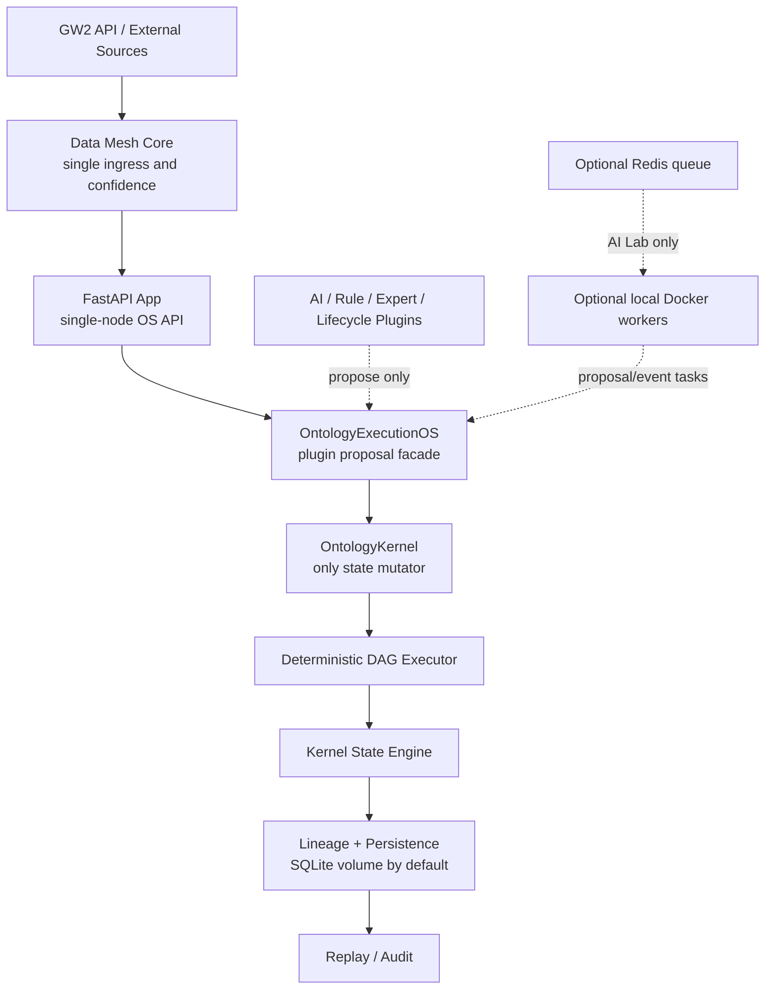

# GW2 Ontology Distributed OS Single-Node WSL2/Docker Assessment

Updated: 2026-07-01

Input document: `E:\Downloads\GW2_Ontology_Distributed_OS_Unified_v1.md`

Deployment boundary:

```text
Single physical machine
Windows host
WSL2 Linux runtime
Docker / Docker Compose
No Kubernetes
No multi-host cluster
No remote worker fleet
```

## 1. Executive Conclusion

The distributed OS document is directionally correct on the most important rule:

```text
Only OntologyKernel can mutate state.
```

However, for the real environment, the target should not be a multi-node distributed system. The correct production shape is:

```text
Single-node Ontology Execution OS
with optional local Docker worker processes
and one authoritative kernel/state/lineage store.
```

Recommended interpretation:

| Spec concept | Single-node WSL2/Docker interpretation | Decision |
| --- | --- | --- |
| Distributed DAG scheduler | Deterministic in-process or local-container scheduler | Keep, but single-node only |
| Worker1/Worker2/WorkerN | Optional stateless local Docker workers | Optional, not required for MVP |
| Redis/Postgres lineage | SQLite for core kernel now; Postgres only if compose profile needs it | Defer Postgres for core |
| Execution Kernel only mutator | `OntologyKernel.execute_kernel_action()` / `OntologyExecutionOS` | Keep and harden |
| AI/RL/LLM plugin layer | Proposal-only plugins | Keep |
| Multi-host fault tolerance | Not applicable | Do not implement now |

Overall assessment:

```text
Architecture fit: Medium-High
Implementation fit for current environment: Medium
Recommended adaptation: Single-node OS profile, not distributed cluster profile
```

## 2. Current Repository Fit

Current implementation already has most of the single-node OS substrate:

| Required capability | Current implementation | Maturity |
| --- | --- | --- |
| Ontology kernel | `OntologyKernel` / `OntologyRuntimeKernel` | L3 |
| DAG scheduler | `RuntimeScheduler`, `DAGExecutor`, `/ontology/runtime/scheduler/execute` | L3 |
| State transition | `ExecutionEngine`, `StateEngine`, kernel state | L3 |
| Lineage | `LineageTracker`, `LineageStore`, durable persistence | L3 |
| Replay | `ReplayEngine`, `replay_persisted()` | L3 |
| Plugin proposal layer | `ontology/execution_os.py` | L2-L3, newly started |
| Data Mesh confidence | `DataMeshConfidenceAdapter`, Data Mesh source registry | L2-L3 |
| Local Docker deployment | `docker-compose.yml`, `docker-compose.prod.yml`, `docker-compose.expert-ai.yml` | L2-L3 |

Important current compose reality:

- `docker-compose.prod.yml`: `app + nginx + gw2-data` volume. This is the right default production-like single-node profile.
- `docker-compose.yml`: development profile, exposes app directly, enables AI Lab by default.
- `docker-compose.expert-ai.yml`: heavy local lab stack with Postgres, Neo4j, Qdrant, Redis, Celery worker, trainer. This should remain optional and AI Lab scoped.

## 3. Single-Node Target Architecture

For WSL2 + Docker, the right target is:



Key point:

```text
Docker containers may be distributed as processes,
but execution truth must remain centralized in one kernel authority.
```

## 4. What To Keep From The Distributed Spec

Keep these principles exactly:

1. Single execution authority.
2. DAG-based scheduling.
3. Workers are stateless.
4. AI/RL/Rule systems only propose actions.
5. Every state mutation records lineage.
6. Replay validates deterministic state.

These map well to the current code:

- `OntologyKernel.execute()`
- `OntologyKernel.execute_kernel_action()`
- `OntologyExecutionOS.execute_proposals()`
- `RuntimeScheduler`
- `DAGExecutor`
- `LineageTracker`
- `ReplayEngine`

## 5. What To Downgrade For Single Machine

Do not implement these as distributed infrastructure yet:

| Distributed spec item | Why downgrade | Single-node replacement |
| --- | --- | --- |
| Multiple kernel service containers | Risks split-brain state truth | One app process owns kernel per tenant |
| Remote worker fleet | No multi-host environment | Optional local workers for offline AI/training only |
| Global Redis/Postgres lineage as mandatory | Adds ops burden and failure modes | SQLite durable lineage in `gw2-data` volume first |
| Networked scheduler service | Unnecessary hop | In-process scheduler inside kernel |
| Horizontal scaling | WSL2 single host bottleneck | Compose profile + resource limits |
| Distributed consensus/locks | Overkill | SQLite transaction boundaries + single kernel writer |

## 6. Recommended Docker Profiles

### Profile A: Core Production Single-Node

Use for real product testing:

```powershell
docker compose -f docker-compose.prod.yml up --build
```

Expected services:

- `app`
- `nginx`
- `gw2-data` volume

Recommended defaults:

```text
ENV=production
ENABLE_AI_LAB_ROUTES=false
ENABLE_EXPERIMENTAL_ROUTES=false
ENABLE_INFRASTRUCTURE_ROUTES=true
ENABLE_COMMERCE_ROUTES=true
```

This profile should be the canonical “single-node OS” baseline.

### Profile B: Development Single-Node

Use for local feature work:

```powershell
docker compose up --build
```

Risk:

- AI Lab and experimental routes are enabled by default.
- This is correct for development, not production evaluation.

### Profile C: AI Lab Local Stack

Use only for offline Expert AI experiments:

```powershell
docker compose -f docker-compose.expert-ai.yml up --build
```

Services:

- app
- worker
- trainer
- postgres
- neo4j
- qdrant
- redis

Interpretation:

```text
This is not the core execution OS.
This is local AI Lab infrastructure that may produce plugin proposals.
```

## 7. Worker Model Recommendation

For single-node WSL2, workers should not execute kernel mutations directly.

Correct worker contract:

```text
Worker receives task
Worker computes proposal/evidence
Worker returns KernelActionProposal
OntologyExecutionOS validates proposal
OntologyKernel executes accepted action
Lineage records mutation
Replay verifies result
```

Incorrect model:

```text
Worker directly updates state, graph, DB, or lineage.
```

Current new implementation already supports the correct direction:

- `KernelActionProposal`
- `KernelMutationGuard`
- `OntologyExecutionOS`
- `AISuggestionPlugin`
- `RuleValidationPlugin`
- `CommerceLineagePlugin`

## 8. State And Persistence Recommendation

For the current environment:

| State type | Recommended store |
| --- | --- |
| Core ontology state | SQLite via existing kernel persistence |
| Kernel lineage | SQLite via existing kernel persistence |
| Product data | Existing SQLite DB |
| AI Lab graph/memory/vector | Optional Postgres/Neo4j/Qdrant only in AI Lab compose |
| Queue | Optional Redis only for trainer/Expert AI tasks |

Do not require Postgres for the core Ontology Kernel until one of these becomes true:

- SQLite write contention becomes measurable.
- replay history outgrows checkpoint strategy.
- multi-user concurrency requires stronger isolation.
- deployment leaves single-node WSL2.

## 9. Readiness Gaps For Single-Node Production OS

Highest priority gaps:

1. Compose hardening
   - Add resource limits.
   - Add restart policy consistency.
   - Add health/readiness checks for optional AI Lab services.
   - Add a documented `.env.production.single-node`.

2. Kernel persistence hardening
   - Persist compiled manifests.
   - Add manifest hash/signature.
   - Add lineage checkpointing.
   - Add replay performance tests.

3. Worker/plugin boundary
   - Route all AI Lab worker outputs through `KernelActionProposal`.
   - Add tests that AI Lab routes cannot directly mutate ontology state.
   - Add plugin registry and plugin capability metadata.

4. Data Mesh ingress boundary
   - Data Mesh should be the only data confidence/source owner.
   - Data Acquisition fetchers should not become truth sources.
   - Add a single-node data refresh queue with bounded concurrency.

5. Operational safety
   - Add backup/restore for `gw2-data`.
   - Add `docker compose` smoke command.
   - Add release gate check for `/api/governance/routes`.
   - Add log rotation guidance for WSL2.

## 10. Fit/No-Fit Matrix

| Requirement from attached doc | Fit for current system | Fit for WSL2 single-node | Recommendation |
| --- | --- | --- | --- |
| Ontology-driven execution kernel | High | High | Implement/harden |
| DAG scheduling | High | High | Keep in-process |
| Multi-worker distributed execution | Medium | Low-Medium | Optional local workers only |
| Single kernel authority | High | High | Enforce everywhere |
| Full lineage tracking | High | High | Harden persistence/checkpoints |
| Replayable execution | High | High | Keep as release gate |
| Redis/Postgres lineage | Medium | Medium-Low | Optional, not core requirement |
| Worker containers | Medium | Medium | Use for AI Lab/training, not core mutation |
| Multi-host distributed OS | Low | Low | Do not implement now |

## 11. Recommended Next Implementation Steps

P0: Define single-node deployment contract.

- Add `docs/single-node-wsl2-docker-runbook.md`.
- Add `.env.example.single-node`.
- Document production compose as the canonical OS profile.

P1: Convert distributed OS spec into single-node OS gates.

- Add a startup/report function that verifies:
  - AI Lab disabled in production.
  - one kernel mutation path.
  - persistence enabled.
  - replay passes.
  - Data Mesh source registry loaded.

P1: Add plugin registry.

- Register plugin metadata for AI suggestion, Rule validation, Commerce lineage, Data Mesh confidence, Lifecycle simulation.
- Every plugin must declare:
  - role
  - proposal action types
  - mutation policy = propose only
  - allowed evidence keys

P2: Add local worker bridge.

- Worker produces `KernelActionProposal`.
- App/kernel process executes proposal.
- Redis remains optional and AI Lab scoped.

P2: Add single-node backup/replay command.

- Export kernel state + lineage.
- Restore into fresh volume.
- Run replay check.

## 12. Final Assessment

The attached document is useful as an execution philosophy, but its distributed topology should be adapted.

For this project, the right near-term target is:

```text
Foundry-like single-node Ontology Execution OS
running on WSL2 + Docker Compose
with one authoritative kernel
and optional local AI/worker containers that only propose actions.
```

This gives the key industrial guarantees without importing unnecessary distributed-systems risk:

- deterministic execution
- auditable lineage
- replayable state
- minimized production exposure
- AI plugin isolation
- simple single-machine operations

The system should graduate to true distributed execution only after the single-node kernel has durable manifests, checkpointed replay, backup/restore, and plugin proposal gates passing reliably.
